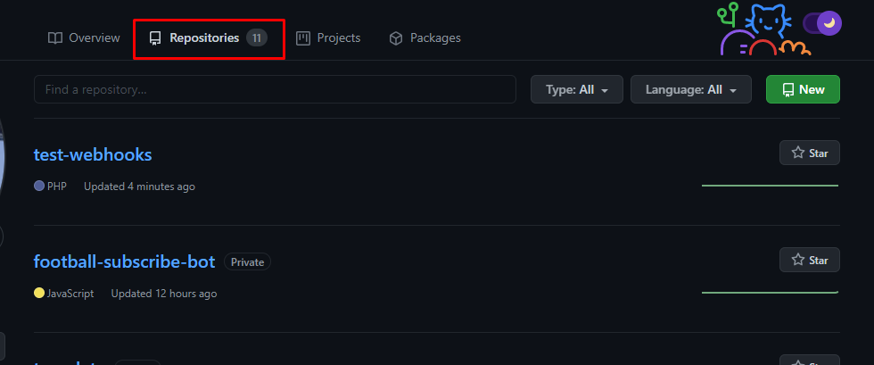
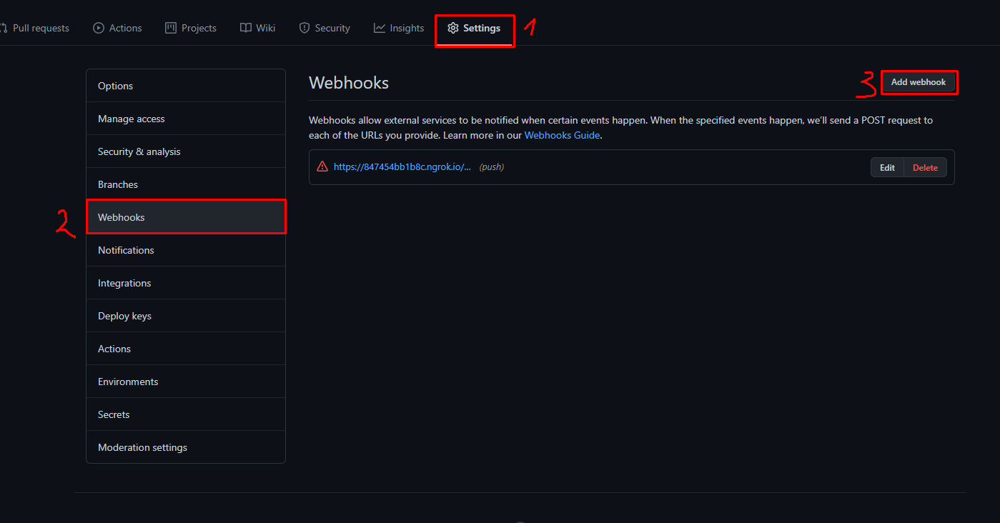
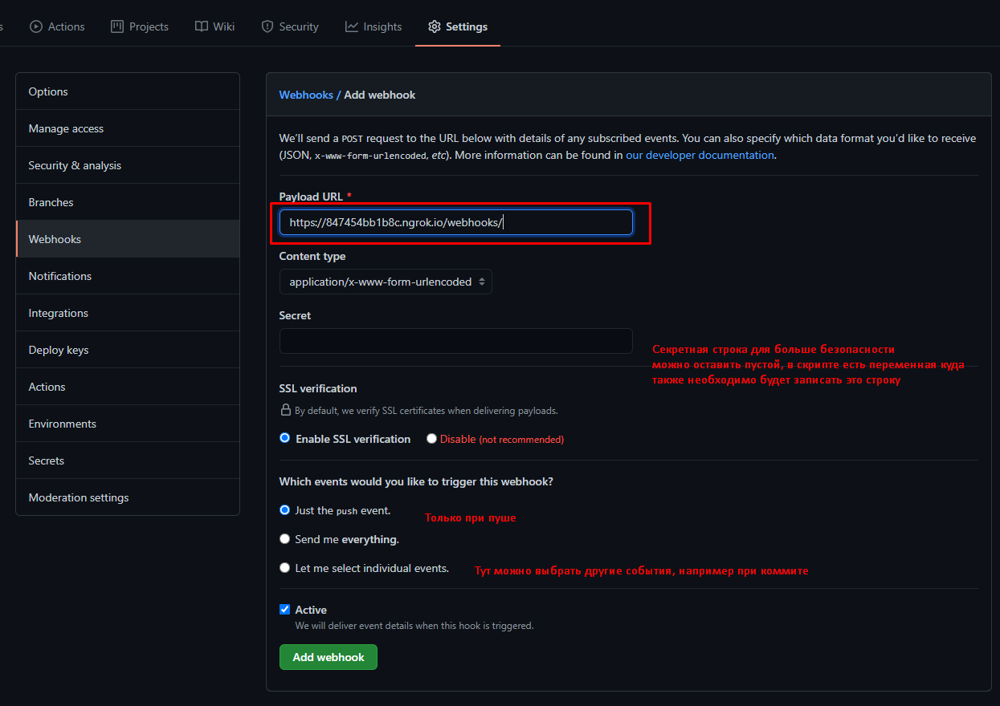

# Автопуш на сервер

1. Заходим в свой репозиторий на github

2. Переходим в нужный репозиторий
3. Переходим в Settings/Webhooks
4. Нажимаем кнопку Add webhook

5. Вписываем на какой адрес пойдет запрос от Github.

6. Создаем php скрипт, который будет ловить запрос от Github и обновлять наш сервер. Сам скрит лежит в папке рядом с этой инструкцией.
7. После того как все настроено и подключено, слелай коммит и запуш его на github, сервер должен автоматически обнавиться.
